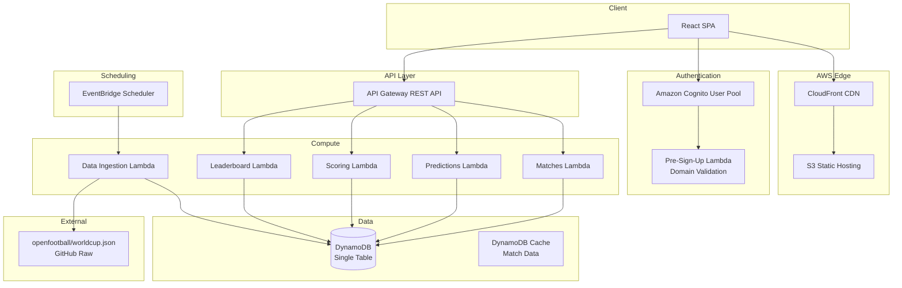

# Design Document

## Overview

The Mundial 2026 Predictions Portal is a serverless web application deployed on AWS that enables Any2Cloud employees to predict FIFA World Cup 2026 match outcomes. The system ingests match data from the openfootball/worldcup.json repository (with a pluggable data abstraction layer for future API migration), allows authenticated users to submit match winner, final score, and tournament winner predictions, calculates scores based on prediction accuracy, and displays a real-time leaderboard.

### Key Design Decisions

1. **Serverless architecture**: AWS Lambda + API Gateway + DynamoDB to minimize operational overhead, auto-scale for the ~100 concurrent users, and stay cost-effective for a time-bounded tournament application (June 11 – July 19, 2026).
2. **Amazon Cognito for authentication**: Provides managed user pools with email domain validation via a pre-sign-up Lambda trigger to enforce the @any2cloud.com restriction.
3. **React SPA frontend**: Hosted on S3 + CloudFront for global low-latency access with HTTPS via ACM certificates.
4. **DynamoDB single-table design**: Optimized for the access patterns of predictions, scores, and leaderboard queries with minimal latency.
5. **Data abstraction layer**: A pluggable adapter pattern for match data ingestion, initially backed by the openfootball GitHub raw JSON endpoint, replaceable with an external API without core logic changes.

## Architecture



### Request Flow

1. User accesses the SPA via CloudFront (HTTPS).
2. Cognito handles authentication; the pre-sign-up trigger validates the @any2cloud.com domain.
3. Authenticated requests include a JWT token in the Authorization header.
4. API Gateway validates the JWT via a Cognito authorizer before routing to Lambda functions.
5. Lambda functions interact with DynamoDB for CRUD operations.
6. EventBridge triggers the ingestion Lambda on a schedule (every 6 hours) to pull match data and results from the openfootball source.

## Components and Interfaces

### 1. Authentication Component

**Technology**: Amazon Cognito User Pool + Pre-Sign-Up Lambda Trigger

**Responsibilities**:
- User registration and sign-in with email/password
- Email domain validation (@any2cloud.com only)
- JWT token issuance and session management
- Password reset flows

**Interface**:
```typescript
// Pre-Sign-Up Lambda Trigger
interface CognitoPreSignUpEvent {
  request: {
    userAttributes: {
      email: string;
    };
  };
  response: {
    autoConfirmUser: boolean;
    autoVerifyEmail: boolean;
  };
}

// Domain validation logic
function validateDomain(email: string): boolean {
  return email.endsWith('@any2cloud.com');
}
```

### 2. Match Data Ingestion Component

**Technology**: Lambda + EventBridge + Data Adapter Pattern

**Responsibilities**:
- Fetch match data from the configured data source
- Transform external data format to internal match model
- Cache match data in DynamoDB
- Detect and store match results when available
- Log warnings for malformed records

**Interface**:
```typescript
// Data Source Adapter (Strategy Pattern)
interface MatchDataSource {
  fetchMatches(): Promise<RawMatchData[]>;
  getName(): string;
}

// OpenFootball adapter implementation
class OpenFootballAdapter implements MatchDataSource {
  private readonly baseUrl: string;

  async fetchMatches(): Promise<RawMatchData[]> {
    // Fetches from https://raw.githubusercontent.com/openfootball/worldcup.json/master/2026/worldcup.json
  }

  getName(): string {
    return 'openfootball';
  }
}

// Ingestion service
interface IngestionService {
  ingestMatches(source: MatchDataSource): Promise<IngestionResult>;
}

interface IngestionResult {
  totalFetched: number;
  totalStored: number;
  skipped: SkippedRecord[];
  resultsUpdated: number;
}

interface SkippedRecord {
  reason: string;
  rawData: unknown;
}
```

### 3. Predictions Component

**Technology**: Lambda + API Gateway

**Responsibilities**:
- Accept and validate match winner predictions
- Accept and validate final score predictions
- Accept and validate tournament winner predictions
- Enforce prediction deadlines (before match start)
- Enforce one prediction per user per match (upsert)

**Interface**:
```typescript
// API Endpoints
// POST /predictions/match-winner
interface MatchWinnerPredictionRequest {
  matchId: string;
  outcome: 'team1' | 'team2' | 'draw'; // 'draw' only valid for group stage
}

// POST /predictions/final-score
interface FinalScorePredictionRequest {
  matchId: string;
  team1Score: number; // 0-99
  team2Score: number; // 0-99
}

// POST /predictions/tournament-winner
interface TournamentWinnerPredictionRequest {
  teamId: string;
}

// GET /predictions/me
interface UserPredictionsResponse {
  predictions: PredictionRecord[];
  totalScore: number;
  leaderboardRank: number;
}

// Validation service
interface PredictionValidator {
  validateMatchWinner(matchId: string, outcome: string, matchPhase: string): ValidationResult;
  validateFinalScore(team1Score: number, team2Score: number): ValidationResult;
  validateTournamentWinner(teamId: string): ValidationResult;
  isMatchOpen(matchId: string): boolean;
  isTournamentWinnerOpen(): boolean;
}

interface ValidationResult {
  valid: boolean;
  error?: string;
}
```

### 4. Scoring Component

**Technology**: Lambda (triggered by DynamoDB Streams or EventBridge)

**Responsibilities**:
- Calculate points when match results are confirmed
- Award 3 points for correct match winner prediction
- Award 5 additional points for correct exact score prediction
- Award 10 points for correct tournament winner prediction
- Handle knockout penalty shootout logic
- Update user total scores

**Interface**:
```typescript
interface ScoringService {
  scoreMatch(matchId: string, result: MatchResult): Promise<ScoringResult>;
  scoreTournamentWinner(winningTeamId: string): Promise<ScoringResult>;
  getUserTotalScore(userId: string): Promise<number>;
}

interface MatchResult {
  matchId: string;
  team1Score: number;  // Regular time + extra time (excluding penalties)
  team2Score: number;
  penaltyWinner?: 'team1' | 'team2'; // Only for knockout matches ending in draw
}

interface ScoringResult {
  matchId: string;
  usersScored: number;
  pointsAwarded: { userId: string; points: number }[];
}
```

### 5. Leaderboard Component

**Technology**: Lambda + DynamoDB GSI

**Responsibilities**:
- Return ranked list of all users by total score
- Apply tiebreaker rules (exact score count, then alphabetical)
- Highlight current user's position

**Interface**:
```typescript
// GET /leaderboard
interface LeaderboardResponse {
  entries: LeaderboardEntry[];
  currentUserRank: number;
}

interface LeaderboardEntry {
  rank: number;
  userId: string;
  displayName: string;
  totalScore: number;
  exactScoreCount: number;
  isCurrentUser: boolean;
}
```

### 6. Match Schedule Component

**Technology**: Lambda + API Gateway

**Responsibilities**:
- Return all matches with status and filtering
- Compute match status (upcoming, in progress, completed)
- Support filtering by phase and group

**Interface**:
```typescript
// GET /matches?phase={phase}&group={group}
interface MatchesResponse {
  matches: MatchView[];
  totalCount: number;
}

interface MatchView {
  matchId: string;
  team1: TeamInfo;
  team2: TeamInfo;
  date: string;       // ISO 8601
  time: string;       // HH:mm UTC
  venue: string;
  phase: TournamentPhase;
  group?: string;     // A-L, only for group stage
  status: 'upcoming' | 'in_progress' | 'completed';
  result?: {
    team1Score: number;
    team2Score: number;
    penaltyWinner?: 'team1' | 'team2';
  };
}

type TournamentPhase = 'group_stage' | 'round_of_32' | 'round_of_16' | 'quarter_finals' | 'semi_finals' | 'third_place' | 'final';
```

## Data Models

### DynamoDB Single-Table Design

The application uses a single DynamoDB table with a composite primary key (PK, SK) and Global Secondary Indexes (GSIs) to support all access patterns efficiently.

**Table: MundialPredictions**

| Access Pattern | PK | SK | GSI |
|---|---|---|---|
| Get match by ID | `MATCH#{matchId}` | `METADATA` | - |
| List matches by phase | `PHASE#{phase}` | `MATCH#{date}#{matchId}` | - |
| Get user prediction for match | `USER#{userId}` | `PRED#MATCH#{matchId}` | - |
| Get all user predictions | `USER#{userId}` | `PRED#*` (begins_with) | - |
| Get tournament winner prediction | `USER#{userId}` | `PRED#TOURNAMENT_WINNER` | - |
| Get user score | `USER#{userId}` | `SCORE` | - |
| Leaderboard (ranked) | - | - | GSI1: `type=SCORE`, sorted by `totalScore` |
| Predictions for a match (scoring) | `MATCH_PREDS#{matchId}` | `USER#{userId}` | - |

### Entity Schemas

```typescript
// Match Entity
interface MatchEntity {
  PK: string;           // MATCH#{matchId}
  SK: string;           // METADATA
  matchId: string;
  team1Id: string;
  team1Name: string;
  team2Id: string;
  team2Name: string;
  date: string;         // ISO 8601 date
  time: string;         // HH:mm UTC
  venue: string;
  phase: TournamentPhase;
  group?: string;       // A-L
  status: 'upcoming' | 'in_progress' | 'completed';
  team1Score?: number;
  team2Score?: number;
  penaltyWinner?: 'team1' | 'team2';
  lastUpdated: string;  // ISO 8601 timestamp
}

// Phase Index Entity (for listing matches by phase)
interface PhaseIndexEntity {
  PK: string;           // PHASE#{phase} or PHASE#{phase}#GROUP#{group}
  SK: string;           // MATCH#{date}#{matchId}
  matchId: string;
  team1Name: string;
  team2Name: string;
  date: string;
  time: string;
  venue: string;
  status: 'upcoming' | 'in_progress' | 'completed';
  team1Score?: number;
  team2Score?: number;
}

// Prediction Entity
interface PredictionEntity {
  PK: string;           // USER#{userId}
  SK: string;           // PRED#MATCH#{matchId} or PRED#TOURNAMENT_WINNER
  userId: string;
  matchId?: string;
  predictionType: 'match_winner' | 'final_score' | 'tournament_winner';
  // Match winner fields
  outcome?: 'team1' | 'team2' | 'draw';
  // Final score fields
  team1Score?: number;
  team2Score?: number;
  // Tournament winner fields
  teamId?: string;
  teamName?: string;
  // Metadata
  createdAt: string;
  updatedAt: string;
}

// Match Predictions Entity (for scoring - denormalized)
interface MatchPredictionsEntity {
  PK: string;           // MATCH_PREDS#{matchId}
  SK: string;           // USER#{userId}
  userId: string;
  matchId: string;
  winnerOutcome?: 'team1' | 'team2' | 'draw';
  team1Score?: number;
  team2Score?: number;
  updatedAt: string;
}

// User Score Entity
interface UserScoreEntity {
  PK: string;           // USER#{userId}
  SK: string;           // SCORE
  GSI1PK: string;       // LEADERBOARD
  GSI1SK: string;       // SCORE#{padded_inverted_score}#{padded_inverted_exact}#{displayName}
  userId: string;
  displayName: string;
  totalScore: number;
  exactScoreCount: number;
  matchWinnerCorrect: number;
  tournamentWinnerCorrect: boolean;
  lastUpdated: string;
}

// Team Entity
interface TeamEntity {
  PK: string;           // TEAM#{teamId}
  SK: string;           // METADATA
  teamId: string;
  teamName: string;
  group: string;        // A-L
  fifaCode: string;     // 3-letter code
}
```

### GSI Design

**GSI1 (Leaderboard Index)**:
- PK: `GSI1PK` = `"LEADERBOARD"`
- SK: `GSI1SK` = `SCORE#{invertedScore}#{invertedExactCount}#{displayName}`
- Purpose: Retrieve all users sorted by score descending, with tiebreakers applied via sort key ordering
- The inverted score (e.g., `99999 - actualScore` zero-padded) ensures descending order in DynamoDB's ascending sort

### OpenFootball Data Mapping

The openfootball/worldcup.json format provides match data in the following structure (based on the football.json schema):

```json
{
  "name": "World Cup 2026",
  "rounds": [
    {
      "name": "Matchday 1",
      "matches": [
        {
          "date": "2026-06-11",
          "team1": "Mexico",
          "team2": "Country X",
          "score": { "ft": [2, 1] },
          "group": "A"
        }
      ]
    }
  ]
}
```

The ingestion adapter transforms this into the internal `MatchEntity` format, generating stable match IDs from the combination of date + teams, and mapping round names to tournament phases.

## Correctness Properties

*A property is a characteristic or behavior that should hold true across all valid executions of a system — essentially, a formal statement about what the system should do. Properties serve as the bridge between human-readable specifications and machine-verifiable correctness guarantees.*

### Property 1: Email domain validation

*For any* email string, the domain validation function SHALL return true if and only if the email ends with `@any2cloud.com` (case-insensitive). All other email domains SHALL be rejected.

**Validates: Requirements 1.3**

### Property 2: Match data validation rejects incomplete records

*For any* raw match record from the data source, if the record is missing any of the required fields (team1, team2, date, time, or venue), the ingestion service SHALL skip that record and include it in the skipped records list. Records with all required fields SHALL be accepted.

**Validates: Requirements 2.8**

### Property 3: Prediction outcome validation by tournament phase

*For any* match prediction submission, if the match is in the Group Stage phase, the system SHALL accept outcomes of `team1`, `team2`, or `draw`. If the match is in any Knockout Stage phase, the system SHALL accept only `team1` or `team2` and SHALL reject `draw`.

**Validates: Requirements 3.1, 3.2**

### Property 4: Prediction storage round-trip

*For any* valid prediction (match winner, final score, or tournament winner), storing the prediction and then retrieving it SHALL produce a prediction record with identical user ID, match ID (or team ID for tournament winner), and prediction values.

**Validates: Requirements 3.3, 4.2, 5.2**

### Property 5: Prediction upsert replaces previous

*For any* user and match, if the user submits multiple predictions sequentially for the same match, only the most recently submitted prediction SHALL be stored. The total number of predictions for that user-match pair SHALL always be exactly one.

**Validates: Requirements 3.4**

### Property 6: Prediction deadline enforcement

*For any* match with status `in_progress` or `completed`, and for any prediction type (match winner, final score), the system SHALL reject the prediction submission. *For any* match with status `upcoming`, the system SHALL accept valid prediction submissions. The tournament winner prediction SHALL be rejected if and only if the Final match has status `in_progress` or `completed`.

**Validates: Requirements 3.6, 4.5, 5.4**

### Property 7: Score value validation

*For any* integer value submitted as a goal count in a final score prediction, the system SHALL accept the value if and only if it is a non-negative integer in the range [0, 99]. Values outside this range, non-integer values, or negative values SHALL be rejected.

**Validates: Requirements 4.3**

### Property 8: Tournament winner team validation

*For any* team ID submitted as a tournament winner prediction, the system SHALL accept the prediction if and only if the team ID belongs to one of the 48 participating teams. Invalid or non-existent team IDs SHALL be rejected.

**Validates: Requirements 5.1**

### Property 9: Scoring correctness

*For any* confirmed match result and set of user predictions, the scoring function SHALL award: exactly 3 points to users whose match winner prediction matches the actual outcome, exactly 5 additional points (total 8) to users whose predicted score exactly matches the final score, exactly 0 points to users who predicted incorrectly or did not submit a prediction, and exactly 10 points for a correct tournament winner prediction. The total score for any user SHALL equal the sum of all individual awards and SHALL never be negative.

**Validates: Requirements 6.1, 6.2, 6.3, 6.4, 6.6**

### Property 10: Penalty shootout scoring uses penalty winner

*For any* knockout match that ends in a draw after extra time and is decided by penalty shootout, the scoring function SHALL evaluate the match winner prediction against the team that won the penalty shootout, not the drawn regular-time result.

**Validates: Requirements 6.7**

### Property 11: Leaderboard ordering with tiebreakers

*For any* set of user scores, the leaderboard SHALL be ordered such that: (a) users with higher total scores appear before users with lower total scores, (b) among users with equal total scores, those with more correct exact score predictions appear first, (c) among users with equal total scores and equal exact score counts, they SHALL share the same rank and be ordered alphabetically by display name.

**Validates: Requirements 7.1, 7.3, 7.4**

### Property 12: Match filtering returns correct subsets

*For any* phase filter applied to the match list, every returned match SHALL belong to the specified phase and no matches of that phase SHALL be excluded. When a group filter is additionally applied to Group Stage matches, every returned match SHALL belong to the specified group.

**Validates: Requirements 8.4, 8.5**

### Property 13: Match status computation

*For any* match, the status SHALL be computed as: `upcoming` if the current time is before the scheduled start time, `in_progress` if the current time is at or after the scheduled start time and no final result has been recorded, and `completed` if a final result has been recorded. These three states SHALL be mutually exclusive and exhaustive.

**Validates: Requirements 8.2**

### Property 14: Error response sanitization

*For any* internal error that occurs during request processing, the error response returned to the client SHALL NOT contain stack traces, internal file paths, database queries, or infrastructure identifiers. The response SHALL contain only a generic error message.

**Validates: Requirements 10.3**

## Error Handling

### Client-Side Errors (4xx)

| Error Scenario | HTTP Status | Response |
|---|---|---|
| Unauthenticated request | 401 | `{ "error": "Authentication required" }` |
| Invalid email domain (sign-up) | 403 | `{ "error": "Only Any2Cloud employees can access the Portal" }` |
| Prediction for started/completed match | 409 | `{ "error": "Predictions are closed for this match" }` |
| Invalid score value (outside 0-99) | 400 | `{ "error": "Goal values must be integers between 0 and 99" }` |
| Invalid outcome for knockout (draw) | 400 | `{ "error": "Draw is not a valid outcome for knockout matches" }` |
| Invalid team ID for tournament winner | 400 | `{ "error": "Selected team is not a participating team" }` |
| Match not found | 404 | `{ "error": "Match not found" }` |

### Server-Side Errors (5xx)

| Error Scenario | Handling Strategy |
|---|---|
| DynamoDB throttling | Exponential backoff with jitter (3 retries) |
| Data source unavailable | Return cached data, set `dataStale: true` flag |
| Lambda timeout | API Gateway returns 504, client retries |
| Cognito service error | Display "Authentication service unavailable" message |
| Scoring Lambda failure | Dead letter queue + CloudWatch alarm for manual review |

### Data Integrity

- **Prediction writes**: Use DynamoDB conditional expressions to prevent race conditions on upserts
- **Score updates**: Use atomic counters for total score increments
- **Match result ingestion**: Idempotent writes using match ID as the key — re-ingesting the same result produces no change

## Testing Strategy

### Property-Based Testing

**Library**: [fast-check](https://github.com/dubzzz/fast-check) (TypeScript)

Property-based tests will validate the 14 correctness properties defined above. Each test will:
- Run a minimum of 100 iterations with randomly generated inputs
- Be tagged with a comment referencing the design property
- Tag format: `Feature: mundial-2026-predictions, Property {number}: {property_text}`

**Key generators needed**:
- `arbitraryEmail()` — random email strings with various domains
- `arbitraryMatch()` — random match entities with valid/invalid field combinations
- `arbitraryPrediction()` — random prediction submissions
- `arbitraryMatchResult()` — random match results including penalty scenarios
- `arbitraryUserScoreSet()` — random sets of user scores for leaderboard testing
- `arbitraryScoreValue()` — random integers including edge cases

### Unit Tests (Example-Based)

- Authentication flow: valid login, invalid domain rejection, session expiry
- Data ingestion: parsing openfootball JSON format, handling 104 matches
- Prediction CRUD: create, read, update operations
- Scoring edge cases: exact score match, penalty shootout scenarios
- Leaderboard: specific ranking scenarios with known data

### Integration Tests

- Cognito authentication flow end-to-end
- DynamoDB read/write operations
- EventBridge scheduler triggering ingestion Lambda
- API Gateway authorization with JWT tokens
- Data source fetch from GitHub raw endpoint

### End-to-End Tests

- Full user journey: sign up → browse matches → submit predictions → view leaderboard
- Score calculation after match result ingestion
- Leaderboard update propagation

### Performance Tests

- Load test with 100 concurrent users
- Verify < 5 second response time under load
- DynamoDB capacity planning validation

